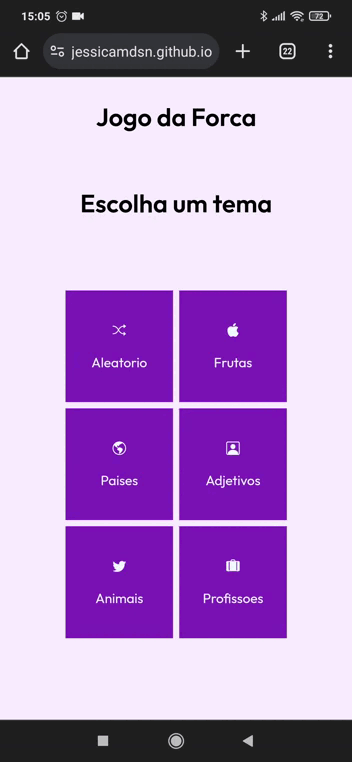
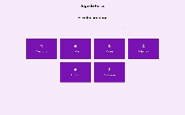

# Jogo da Forca

Um jogo da forca responsivo feito em JavaScript, HTML e CSS.

  

## Descrição

O Jogo da Forca é uma versão online e responsiva do jogo clássico. O jogador pode escolher entre diferentes temas, como frutas, países, adjetivos, animais e profissões, para adivinhar a palavra secreta.

## Funcionalidades

- Interface responsiva para jogar em dispositivos móveis
- Escolha de temas para variar o jogo
- Geração aleatória de palavras dentro do tema escolhido
- Contagem de tentativas e exibição visual da forca

## Como Jogar

1. Acesse o jogo através do link: https://jessicamdsn.github.io/Jogo-da-Forca/

2. Escolha um tema entre frutas, países, adjetivos, animais e profissões.

3. Clique nas letras para tentar adivinhar a palavra secreta.

Esse é um projeto de simulação de lançamento de dados giratorios, responsivo.

## 🚀 Tecnologias
Esse projeto foi desenvolvido com as seguintes tecnologias:

 

 
